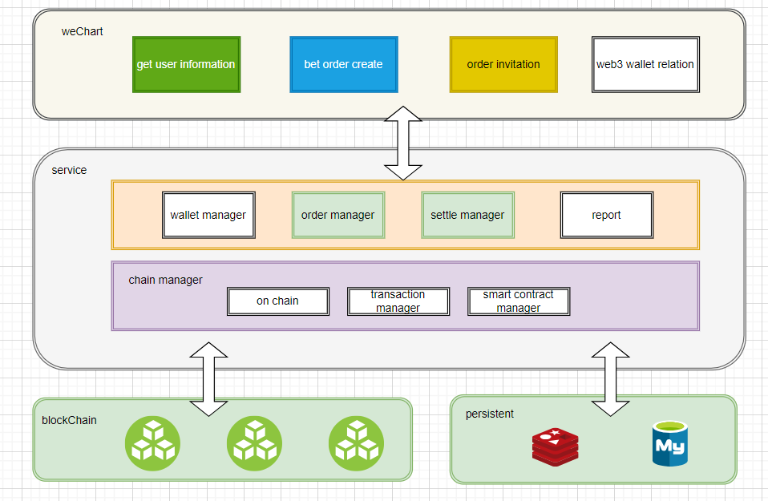
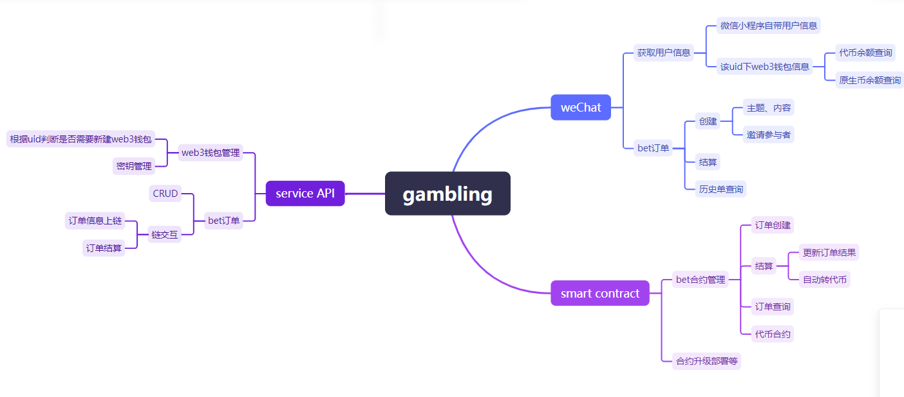
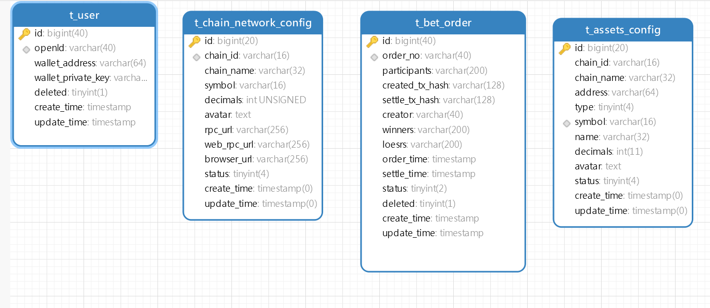

## 整体架构设计

### 架构图

```
diff复制代码+--------------------+
|   微信小程序前端   |
+---------+----------+
          |
          | HTTP/HTTPS
          |
+---------v----------+
|    Go后端服务      |
+---------+----------+
          |
          | HTTP/JSON-RPC
          |
+---------v----------+
|   智能合约 (Solidity)  |
+--------------------+
          |
          | Blockchain (Ethereum)
          |
+---------v----------+
|   以太坊区块链节点  |
+--------------------+
```
### 系统架构图


### 功能点


### 组件说明

1. **微信小程序前端**：提供用户界面，用户通过小程序进行打赌的创建、参与和查看结果等操作。
2. **Go后端服务**：处理前端请求，负责业务逻辑、与数据库交互以及调用智能合约接口。
3. **智能合约**：使用Solidity编写的智能合约，负责打赌信息上链，并根据打赌结果自动进行赌资划拨。
4. **以太坊区块链节点**：承载智能合约的执行环境和数据存储。

## 数据库设计

### 模型设计



### 数据库表结构

### Database Design

#### Table: t_user

| Column Name        | Data Type      | Nullable | Comments                           |
|--------------------|----------------|----------|------------------------------------|
| id                 | bigint(40)     | No       | Primary key                        |
| openId             | varchar(40)    | Yes      | WeChat mini-program user unique identifier |
| wallet_address     | varchar(64)    | Yes      | User's web3 wallet address         |
| wallet_private_key | varchar(128)   | Yes      | User's web3 wallet private key     |
| deleted            | tinyint(1)     | Yes      | Logical delete flag                |
| create_time        | timestamp      | Yes      | Creation timestamp                 |
| update_time        | timestamp      | Yes      | Last update timestamp              |

#### Table: t_bet_order

| Column Name        | Data Type      | Nullable | Comments                           |
|--------------------|----------------|----------|------------------------------------|
| id                 | bigint(40)     | No       | Primary key                        |
| order_no           | varchar(40)    | Yes      | Bet order number                   |
| participants       | varchar(200)   | Yes      | Participants' openIds, separated by commas |
| created_tx_hash    | varchar(128)   | Yes      | Transaction hash for order creation |
| settle_tx_hash     | varchar(128)   | Yes      | Transaction hash for order settlement |
| creator            | varchar(40)    | Yes      | Creator's openId                   |
| winners            | varchar(200)   | Yes      | Winners' openIds                   |
| losers             | varchar(200)   | Yes      | Losers' openIds                    |
| order_time         | timestamp      | Yes      | Order timestamp                    |
| settle_time        | timestamp      | Yes      | Settlement timestamp               |
| status             | tinyint(2)     | Yes      | Order status (0: created, 1: on-chain, 2: on-chain success, 3: on-chain failure, 4: settled) |
| deleted            | tinyint(1)     | Yes      | Logical delete flag                |
| create_time        | timestamp      | Yes      | Creation timestamp                 |
| update_time        | timestamp      | Yes      | Last update timestamp              |

#### Table: t_chain_network_config

| Column Name        | Data Type      | Nullable | Comments                           |
|--------------------|----------------|----------|------------------------------------|
| id                 | bigint(20)     | No       | Primary key                        |
| chain_id           | varchar(16)    | Yes      | Chain ID                           |
| chain_name         | varchar(32)    | Yes      | Chain name                         |
| symbol             | varchar(16)    | Yes      | Native coin symbol                 |
| decimals           | int(10)        | Yes      | Native coin decimals               |
| avatar             | text           | Yes      | Logo image                         |
| rpc_url            | varchar(256)   | Yes      | RPC URL                            |
| web_rpc_url        | varchar(256)   | Yes      | WebSocket URL                      |
| browser_url        | varchar(256)   | Yes      | Blockchain explorer URL            |
| status             | tinyint(4)     | Yes      | Network status (0: disabled, 1: enabled) |
| create_time        | timestamp      | Yes      | Creation timestamp                 |
| update_time        | timestamp      | Yes      | Last update timestamp              |

#### Table: t_assets_config

| Column Name        | Data Type      | Nullable | Comments                           |
|--------------------|----------------|----------|------------------------------------|
| id                 | bigint(20)     | No       | Primary key                        |
| chain_id           | varchar(16)    | Yes      | Chain ID                           |
| chain_name         | varchar(32)    | Yes      | Chain name                         |
| address            | varchar(64)    | Yes      | Contract address (empty for native coin) |
| type               | tinyint(4)     | Yes      | Asset type (0: token, 1: native coin) |
| symbol             | varchar(16)    | No       | Token symbol                       |
| name               | varchar(32)    | Yes      | Token name                         |
| decimals           | int(11)        | Yes      | Token decimals                     |
| avatar             | text           | Yes      | Token avatar                       |
| status             | tinyint(4)     | Yes      | Token status (0: disabled, 1: enabled) |
| create_time        | timestamp      | Yes      | Creation timestamp                 |
| update_time        | timestamp      | Yes      | Last update timestamp              |


## API接口设计

### 用户相关API

#### 注册用户

- **URL**: `/api/register`

- **方法**: POST

- 请求体

  :

  ```
  json复制代码{
      "username": "string",
      "wallet_address": "string"
  }
  ```

- 响应

  :

  ```
  json复制代码{
      "success": true,
      "message": "User registered successfully"
  }
  ```

#### 获取用户信息

- **URL**: `/api/users/{user_id}`

- **方法**: GET

- 响应

  :

  ```
  json复制代码{
      "id": "int",
      "username": "string",
      "wallet_address": "string",
      "created_at": "timestamp"
  }
  ```

### 打赌相关API

#### 创建打赌

- **URL**: `/api/bets`

- **方法**: POST

- 请求体

  :

  ```
  json复制代码{
      "title": "string",
      "description": "string",
      "creator_id": "int"
  }
  ```

- 响应

  :

  ```
  json复制代码{
      "success": true,
      "message": "Bet created successfully",
      "bet_id": "int"
  }
  ```

#### 获取打赌信息

- **URL**: `/api/bets/{bet_id}`

- **方法**: GET

- 响应

  :

  ```
  json复制代码{
      "id": "int",
      "title": "string",
      "description": "string",
      "creator_id": "int",
      "created_at": "timestamp",
      "result": "string",
      "result_time": "timestamp"
  }
  ```

#### 参与打赌

- **URL**: `/api/bets/{bet_id}/participate`

- **方法**: POST

- 请求体

  :

  ```
  json复制代码{
      "user_id": "int",
      "amount": "decimal"
  }
  ```

- 响应

  :

  ```
  json复制代码{
      "success": true,
      "message": "Participation successful"
  }
  ```

#### 公布结果

- **URL**: `/api/bets/{bet_id}/result`

- **方法**: POST

- 请求体

  :

  ```
  json复制代码{
      "result": "string"
  }
  ```

- 响应

  :

  ```
  json复制代码{
      "success": true,
      "message": "Result published successfully"
  }
  ```

### 智能合约相关API（通过Go后端服务与智能合约交互）

#### 上链打赌信息

- **URL**: `/api/contract/bets/{bet_id}/upload`

- **方法**: POST

- 响应

  :

  ```
  json复制代码{
      "success": true,
      "message": "Bet information uploaded to blockchain successfully"
  }
  ```

#### 根据结果自动划拨赌资

- **URL**: `/api/contract/bets/{bet_id}/distribute`

- **方法**: POST

- 响应

  :

  ```
  json复制代码{
      "success": true,
      "message": "Funds distributed based on the result"
  }
  ```

## 智能合约设计

### 打赌智能合约（Solidity）

```
solidity复制代码// SPDX-License-Identifier: MIT
pragma solidity ^0.8.0;

contract Betting {
    struct Bet {
        string title;
        string description;
        address creator;
        string result;
        bool resultPublished;
    }

    struct Participant {
        address user;
        uint256 amount;
    }

    mapping(uint256 => Bet) public bets;
    mapping(uint256 => Participant[]) public participants;
    uint256 public betCounter;

    function createBet(string memory _title, string memory _description) public {
        betCounter++;
        bets[betCounter] = Bet({
            title: _title,
            description: _description,
            creator: msg.sender,
            result: "",
            resultPublished: false
        });
    }

    function participate(uint256 _betId) public payable {
        require(_betId <= betCounter, "Bet does not exist");
        participants[_betId].push(Participant({
            user: msg.sender,
            amount: msg.value
        }));
    }

    function publishResult(uint256 _betId, string memory _result) public {
        require(msg.sender == bets[_betId].creator, "Only the creator can publish the result");
        require(!bets[_betId].resultPublished, "Result already published");
        bets[_betId].result = _result;
        bets[_betId].resultPublished = true;

        // Logic for distributing funds based on result
        distributeFunds(_betId);
    }

    function distributeFunds(uint256 _betId) internal {
        // Implement fund distribution logic here
    }
}
```

## 总结

该架构设计包含了前端、后端和智能合约的完整设计方案。前端使用微信小程序，后端使用Go语言处理业务逻辑和与智能合约的交互，智能合约使用Solidity编写，负责打赌信息上链和自动进行赌资划拨。数据库设计包含了用户表、打赌表和参与表，API接口设计涵盖了用户注册、打赌信息管理和智能合约交互的接口。